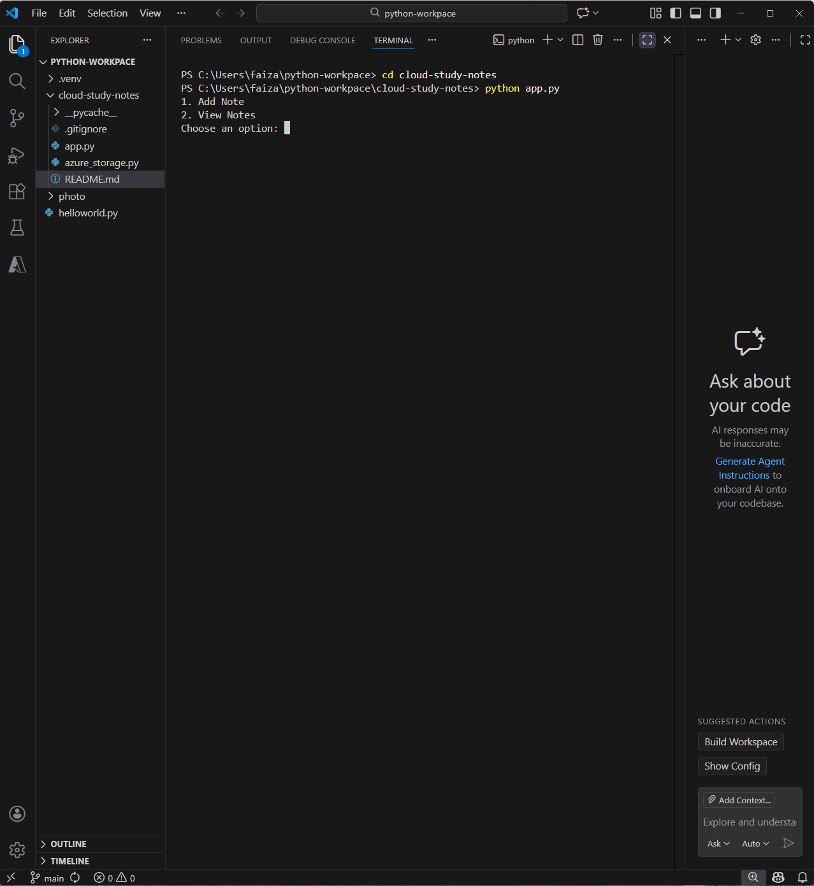

# Project Title & Description

 Cloud Study Notes App(Python)

 This is a beginner-friendly Python CLI application that allows users to add and view notes that are stored in a JSON file and include a title, topic, and timestamp.

## Tech Stack

- Python 3.13.5
- Json
- VS Code
- Azure Blob Storage
- Git/Github 
- Cloud model - Azure Platform as a Service

## Architecture and flow
- CLI → app.py → azure_storage.py → Azure Blob Storage

- User → app.py → azure_storage.py → Azure Blob Storage

## Features
- Add notes
- View notes
- Cloud storage integration
- Input validation and error handling

## How to Run
1. Make sure that the Python is installed
2. Open the terminal create a folder using mkdir name_project
3. Run python app.py 

## How to run locally
- git clone the repo git clone https://github.com/HudaPatel45/cloud-study-notes.git
- Install Python packages(pip install azure-storage-blob)
- Set environment variable AZURE_STORAGE_CONNECTION_STRING
- Run python app.py

## Key learnings
- Modular code design
- Secure credentials with environment variables
- Cloud storage integration
- Git version controls and GitHub Publishing

## What was implemented
- Connected Python application to Azure Blob Storage
- Replaced local JSON storage with cloud-based storage
- Used Azure SDK and environment variables for secure access

## Errors & Issues Faced

**FileNotFoundError when notes.json was missing**
Error: Program crashed when notes.json did not exist
Cause: The file was being opened without checking existence
Solution: Added try-except block to handle FileNotFoundError
<pre>except FileNotFoundError:
return [] </pre>  
**If file is missing, assume there are no notes yet**
- apps continues running 
- New file will be created later when saving
<pre>except json.JSONDecodeError:
return []</pre>
- app resets to empty notes
- User can continue

Learning: Always handle missing file when working with file systems

**Empty title accepted**
This issue is resolved by validation and rules

## Future Improvement
- Web Interface(flask)
- HTTPS deployment
- Multiple storage backeneds

## Screenshots

